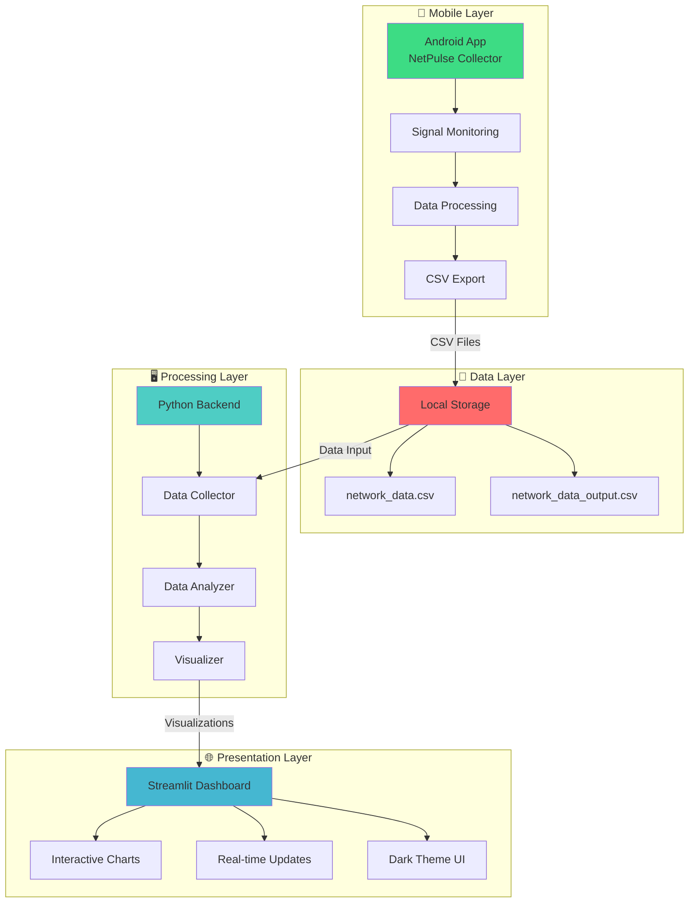
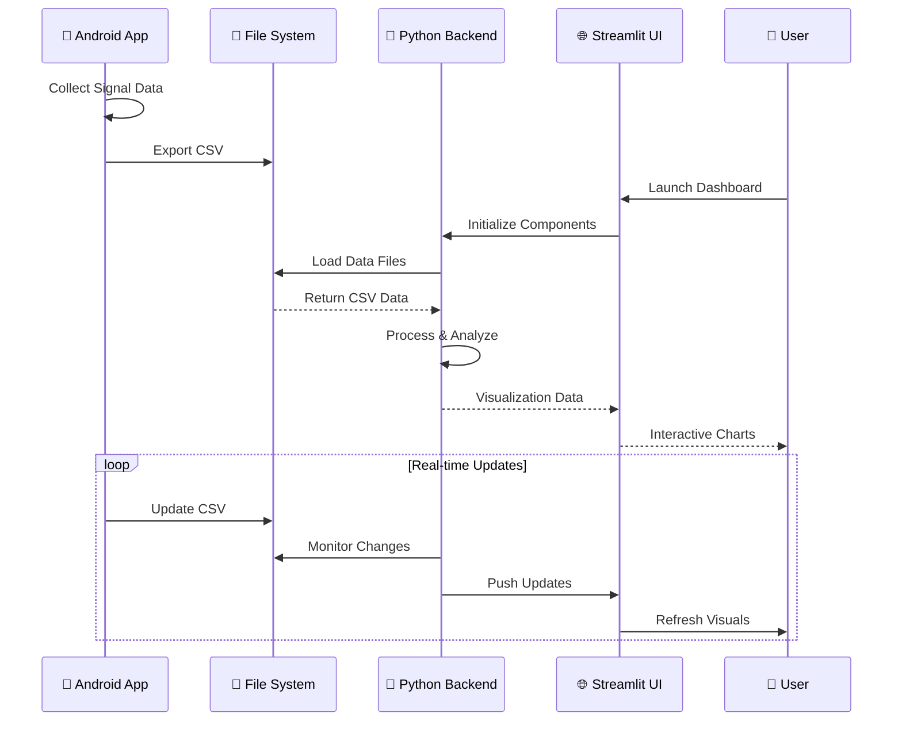

<div align="center">

# 🌐 NetPulse

### *Real-Time Network Analysis & Visualization Platform*

<p align="center">
  
  
  
  
  
  
</p>


<p align="center">
  <a href="#-demo">🚀 Demo</a> •
  <a href="#-features">✨ Features</a> •
  <a href="#-installation">🛠️ Installation</a> •
  <a href="#-usage">📖 Usage</a> •
  <a href="#-contributing">🤝 Contributing</a>
</p>

</div>

---

## � Overview

NetPulse is a cutting-edge **real-time network analysis and visualization platform** that bridges mobile data collection with powerful analytics. Collect cellular signal data directly from your Android device and visualize it through an interactive Streamlit dashboard with advanced analytics capabilities.

### 🎯 Why NetPulse?

- **📱 Mobile-First**: Direct data collection from Android devices
- **🔄 Real-Time**: Live data processing and visualization
- **📈 Advanced Analytics**: Signal quality analysis, trend detection
- **🎨 Beautiful UI**: Modern dark theme with interactive charts
- **🔧 Extensible**: Modular architecture for easy customization

---

## 🚀 Demo

<div align="center">

### 📱➡️📊 Data Flow Visualization

```
📱 Android App → 📄 CSV Export → 🌐 Dashboard → 📊 Analytics
     ↓              ↓              ↓              ↓
  LTE/5G Data   Downloads Folder  Streamlit UI   Live Charts
```

### 🎯 Quick Start - 3 Simple Steps

```
1️⃣ 📱 Collect        2️⃣ 🚀 Launch         3️⃣ 📊 Analyze
┌─────────────┐    ┌─────────────┐    ┌─────────────┐
│Android App  │    │Dashboard    │    │Interactive  │
│Monitors     │ →  │streamlit run│ →  │Charts &     │
│Signal Data  │    │dashboard.py │    │Analytics    │
└─────────────┘    └─────────────┘    └─────────────┘
```

</div>

---

## ✨ Features

<div align="center">

### 🎯 Core Capabilities

```
📱 Mobile Collection    📊 Real-Time Dashboard    🔍 Advanced Analytics
┌─────────────────┐    ┌─────────────────┐      ┌─────────────────┐
│ • LTE/5G Data   │    │ • Live Charts   │      │ • Trend Analysis│
│ • Auto Export   │ →  │ • Dark Theme    │  →   │ • Anomaly Detect│
│ • 3-sec Updates │    │ • Responsive UI │      │ • Performance   │
│ • Permissions   │    │ • Plotly Powered│      │ • Quality Score │
└─────────────────┘    └─────────────────┘      └─────────────────┘
```

### � Technology Stack Visual

```
Frontend Layer          Backend Layer           Data Layer
┌─────────────┐        ┌─────────────┐        ┌─────────────┐
│ Streamlit   │ ←───── │ Python 3.7+ │ ←───── │ CSV Files   │
│ Dashboard   │        │ Pandas      │        │ Signal Data │
│ Plotly      │        │ NumPy       │        │ Timestamps  │
│ Dark Theme  │        │ Analytics   │        │ Metrics     │
└─────────────┘        └─────────────┘        └─────────────┘
       ↑                        ↑                      ↑
┌─────────────┐        ┌─────────────┐        ┌─────────────┐
│ Mobile App  │        │ Data        │        │ Android     │
│ Kotlin      │        │ Processing  │        │ Storage     │
│ Jetpack     │        │ Real-time   │        │ Downloads   │
│ Compose     │        │ Updates     │        │ Folder      │
└─────────────┘        └─────────────┘        └─────────────┘
```

</div>

---

## 🛠️ Tech Stack

| Technology | Purpose |
|------------|---------|
| Python | Core Language |
| Streamlit | Dashboard UI |
| Pandas | Data Analysis |
| Plotly | Visualizations |
| Android | Mobile Platform |
| Kotlin | Mobile Development |

---

## 📱 NetPulse Collector - Android App

<div align="center">

### � App Interface & Workflow

```
┌─────────────────────────────────────────────────────────────┐
│                  📱 NetPulse Collector                      │
├─────────────────────────────────────────────────────────────┤
│                                                             │
│  🔴 Live Signal Monitoring                                  │
│  ┌─────────────────────────────────────────────────────┐   │
│  │ Network Type: LTE                                   │   │
│  │ Signal Strength: -85 dBm                           │   │
│  │ Quality: Good                                       │   │
│  │ Last Update: 14:30:25                              │   │
│  └─────────────────────────────────────────────────────┘   │
│                                                             │
│  📊 Data Collection Status                                  │
│  • Samples Collected: 1,247                                │
│  • Refresh Rate: 3 seconds                                 │
│  • File Size: 125 KB                                       │
│                                                             │
│  ┌─────────────────────────────────────────────────────┐   │
│  │            📤 Export to CSV                        │   │
│  └─────────────────────────────────────────────────────┘   │
│                                                             │
└─────────────────────────────────────────────────────────────┘
```

### 🔄 Data Collection Process

```
Start App → Request Permissions → Monitor Signals → Log Data → Export CSV
    ↓              ↓                    ↓             ↓          ↓
📱 Launch    📍 Location &         📡 Real-time   📝 CSV     📁 Downloads
             📞 Phone State         Data Stream    Format     Folder
```

</div>

### 📋 Technical Specifications

| Feature | Details |
|---------|---------|
| **Platform** | Android 6.0+ (API 23+) |
| **Language** | Kotlin with Jetpack Compose |
| **Permissions** | `ACCESS_FINE_LOCATION`, `READ_PHONE_STATE` |
| **Data Format** | CSV with timestamp, network type, signal strength |
| **Update Frequency** | 3 seconds |
| **Export Location** | `/Downloads/signal_log.csv` |

<details>
<summary>📱 <strong>Complete Android App Source Code (Kotlin)</strong></summary>

```kotlin
package com.example.netpulsecollector

import android.Manifest
import android.content.ContentValues
import android.content.pm.PackageManager
import android.net.Uri
import android.os.Build
import android.os.Bundle
import android.os.Environment
import android.provider.MediaStore
import android.telephony.TelephonyManager
import android.telephony.CellInfo
import android.telephony.CellInfoLte
import android.telephony.CellInfoNr
import android.telephony.CellSignalStrengthLte
import android.telephony.CellSignalStrengthNr
import android.util.Log
import android.widget.Toast
import androidx.activity.ComponentActivity
import androidx.activity.compose.setContent
import androidx.activity.enableEdgeToEdge
import androidx.compose.foundation.layout.*
import androidx.compose.material3.*
import androidx.compose.runtime.*
import androidx.compose.ui.Modifier
import androidx.compose.ui.tooling.preview.Preview
import androidx.compose.ui.unit.dp
import androidx.core.app.ActivityCompat
import androidx.core.content.ContextCompat
import androidx.lifecycle.lifecycleScope
import com.example.netpulsecollector.ui.theme.NetPulseCollectorTheme
import kotlinx.coroutines.delay
import kotlinx.coroutines.launch
import java.io.File
import java.io.FileOutputStream
import java.io.IOException
import java.text.SimpleDateFormat
import java.util.Date
import java.util.Locale

class MainActivity : ComponentActivity() {

    private val PERMISSION_REQUEST_CODE = 100
    private var signalInfoText by mutableStateOf("Waiting for signal data...")
    private val TAG = "MainActivity"
    private val FILE_NAME = "signal_log.csv"
    private val CSV_HEADER = "Timestamp,NetworkType,dBm"

    override fun onCreate(savedInstanceState: Bundle?) {
        super.onCreate(savedInstanceState)
        enableEdgeToEdge()

        setContent {
            NetPulseCollectorTheme {
                Scaffold(modifier = Modifier.fillMaxSize()) { innerPadding ->
                    Column(modifier = Modifier.padding(innerPadding).padding(16.dp)) {
                        SignalInfoDisplay(signalInfo = signalInfoText)
                        Spacer(modifier = Modifier.height(16.dp))
                        Button(onClick = { exportCsvToDownloads() }) {
                            Text("Export CSV")
                        }
                    }
                }
            }
        }

        if (!hasPermissions()) {
            ActivityCompat.requestPermissions(
                this,
                arrayOf(
                    Manifest.permission.ACCESS_FINE_LOCATION,
                    Manifest.permission.READ_PHONE_STATE
                ),
                PERMISSION_REQUEST_CODE
            )
        } else {
            startSignalUpdates()
        }
    }

    private fun hasPermissions(): Boolean {
        return ContextCompat.checkSelfPermission(this, Manifest.permission.ACCESS_FINE_LOCATION) == PackageManager.PERMISSION_GRANTED &&
                ContextCompat.checkSelfPermission(this, Manifest.permission.READ_PHONE_STATE) == PackageManager.PERMISSION_GRANTED
    }

    override fun onRequestPermissionsResult(
        requestCode: Int,
        permissions: Array<out String>,
        grantResults: IntArray
    ) {
        super.onRequestPermissionsResult(requestCode, permissions, grantResults)
        if (requestCode == PERMISSION_REQUEST_CODE) {
            if (grantResults.isNotEmpty() && grantResults.all { it == PackageManager.PERMISSION_GRANTED }) {
                Log.d(TAG, "Permissions granted.")
                startSignalUpdates()
            } else {
                signalInfoText = "Permissions denied. Cannot access signal info."
                Log.d(TAG, "Permissions denied.")
            }
        }
    }

    private fun startSignalUpdates() {
        Log.d(TAG, "Starting signal updates.")
        lifecycleScope.launch {
            while (true) {
                fetchSignalInfo()
                delay(3000) // refresh interval: 3 seconds
            }
        }
    }

    private fun getCurrentTimestamp(): String {
        val sdf = SimpleDateFormat("yyyy-MM-dd HH:mm:ss", Locale.getDefault())
        return sdf.format(Date())
    }

    private fun writeToCsv(logEntry: String) {
        val file = File(filesDir, FILE_NAME)
        try {
            val isNewFile = !file.exists() || file.length() == 0L
            FileOutputStream(file, true).use { output ->
                if (isNewFile) {
                    output.write("$CSV_HEADER\n".toByteArray())
                }
                output.write("$logEntry\n".toByteArray())
            }
        } catch (e: IOException) {
            Log.e(TAG, "Error writing to CSV file", e)
        }
    }

    private fun exportCsvToDownloads() {
        val sourceFile = File(filesDir, FILE_NAME)
        if (!sourceFile.exists()) {
            Toast.makeText(this, "No CSV file to export", Toast.LENGTH_SHORT).show()
            return
        }

        val resolver = contentResolver
        val contentValues = ContentValues().apply {
            put(MediaStore.Downloads.DISPLAY_NAME, FILE_NAME)
            put(MediaStore.Downloads.MIME_TYPE, "text/csv")
            put(MediaStore.Downloads.RELATIVE_PATH, Environment.DIRECTORY_DOWNLOADS)
            put(MediaStore.Downloads.IS_PENDING, 1)
        }

        val collection =
            if (Build.VERSION.SDK_INT >= Build.VERSION_CODES.Q) {
                MediaStore.Downloads.getContentUri(MediaStore.VOLUME_EXTERNAL_PRIMARY)
            } else {
                MediaStore.Downloads.EXTERNAL_CONTENT_URI
            }

        val itemUri: Uri? = resolver.insert(collection, contentValues)
        if (itemUri != null) {
            resolver.openOutputStream(itemUri).use { out ->
                sourceFile.inputStream().use { input ->
                    input.copyTo(out!!)
                }
            }
            contentValues.clear()
            contentValues.put(MediaStore.Downloads.IS_PENDING, 0)
            resolver.update(itemUri, contentValues, null, null)

            Toast.makeText(this, "CSV exported to Downloads/$FILE_NAME", Toast.LENGTH_LONG).show()
        } else {
            Toast.makeText(this, "Failed to export CSV", Toast.LENGTH_SHORT).show()
        }
    }

    private fun fetchSignalInfo() {
        val telephonyManager = getSystemService(TELEPHONY_SERVICE) as TelephonyManager

        if (ActivityCompat.checkSelfPermission(this, Manifest.permission.ACCESS_FINE_LOCATION) != PackageManager.PERMISSION_GRANTED) {
            signalInfoText = "Location permission not granted."
            return
        }

        val allCellInfo = telephonyManager.allCellInfo
        val timestamp = getCurrentTimestamp()

        if (!allCellInfo.isNullOrEmpty()) {
            val builder = StringBuilder()
            for (cell in allCellInfo) {
                var networkType = "Other"
                var dBm = "N/A"

                when (cell) {
                    is CellInfoLte -> {
                        val cellSignal: CellSignalStrengthLte = cell.cellSignalStrength
                        networkType = "LTE"
                        dBm = cellSignal.dbm.toString()
                        builder.append("LTE - dBm: ${cellSignal.dbm}\n")
                    }
                    is CellInfoNr -> {
                        val cellSignal = cell.cellSignalStrength as? CellSignalStrengthNr
                        networkType = "5G NR"
                        if (cellSignal != null) {
                            dBm = cellSignal.dbm.toString()
                            builder.append("5G NR - dBm: ${cellSignal.dbm}\n")
                        } else {
                            builder.append("5G NR - Signal info unavailable\n")
                        }
                    }
                    else -> {
                        builder.append("Other Network Type Detected\n")
                    }
                }

                if (dBm != "N/A" || networkType != "Other") {
                    val logEntry = "$timestamp,$networkType,$dBm"
                    writeToCsv(logEntry)
                }
            }
            signalInfoText = builder.toString()
        } else {
            signalInfoText = "No signal information available."
            val logEntry = "$timestamp,No Signal,N/A"
            writeToCsv(logEntry)
        }
    }
}

@Composable
fun SignalInfoDisplay(signalInfo: String, modifier: Modifier = Modifier) {
    Column(modifier = modifier) {
        Text(text = "NetPulse Collector", style = MaterialTheme.typography.titleLarge)
        Spacer(modifier = Modifier.height(16.dp))
        Text(text = signalInfo, style = MaterialTheme.typography.bodyLarge)
    }
}

@Preview(showBackground = true)
@Composable
fun SignalInfoPreview() {
    NetPulseCollectorTheme {
        SignalInfoDisplay("Sample signal data: LTE -85 dBm")
    }
}
```

</details>

---

## 📊 Visualizations & Analytics

<div align="center">

### 📈 Dashboard Layout

```
┌─────────────────────────────────────────────────────────────┐
│                    🌐 NetPulse Dashboard                     │
├─────────────────────────────────────────────────────────────┤
│ 📊 Signal Quality Over Time                                 │
│ ┌───────────────────────────────────────────────────────┐   │
│ │     📈 Line Chart                                     │   │
│ │     -85 dBm ────────┐                                │   │
│ │     -90 dBm         │  ╭─╮                          │   │
│ │     -95 dBm         ╰──╯ ╰─╮                        │   │
│ │     -100dBm               ╰────────                │   │
│ │       12:00   13:00   14:00   15:00                │   │
│ └───────────────────────────────────────────────────────┘   │
├─────────────────────────────────────────────────────────────┤
│ 📊 Network Metrics                                          │
│ ┌──────────┐ ┌──────────┐ ┌──────────┐ ┌──────────┐      │
│ │   LTE    │ │   5G     │ │ Latency  │ │ Quality  │      │
│ │ ████████ │ │ ██████   │ │ ███      │ │ █████████│      │
│ │   -85    │ │   -78    │ │   45ms   │ │   Good   │      │
│ └──────────┘ └──────────┘ └──────────┘ └──────────┘      │
└─────────────────────────────────────────────────────────────┘
```

### 🎯 Chart Types Available

```
📈 Line Charts          📊 Bar Charts          🎯 Scatter Plots
┌─────────────┐        ┌─────────────┐        ┌─────────────┐
│ Signal      │        │ Network     │        │ Quality vs  │
│ Strength    │        │ Comparison  │        │ Time        │
│ Over Time   │        │ Metrics     │        │ Correlation │
│             │        │             │        │             │
│ ──╱╲╱─╲─    │        │ ████ ██ ███ │        │ •  • •   •  │
│      ╲   ╲  │        │ ████ ██ ███ │        │  •   • •    │
│       ╲___╲ │        │ ████ ██ ███ │        │ •  •   •  • │
└─────────────┘        └─────────────┘        └─────────────┘
Real-time Updates      Performance Data       Trend Analysis
```

</div>

---

## 🏗️ System Architecture

<div align="center">

### 📊 Data Flow Diagram



### 🔄 Component Interaction



</div>

---

## 📂 Project Structure

<div align="center">

### 🗂️ Repository Organization

</div>

```
NetPulse/
├── 📁 data/                           # Data storage directory
│   ├── 📄 network_data.csv           # Raw input data from Android app
│   └── 📄 network_data_output.csv    # Processed data for analytics
├── 📁 src/                           # Source code directory
│   ├── 🐍 __init__.py               # Package initialization
│   ├── 🔍 analyzer.py               # Data analysis algorithms
│   ├── 📡 collector.py              # Data collection utilities
│   ├── 🌐 dashboard.py              # Streamlit dashboard application
│   ├── 🎯 main.py                   # Main application entry point
│   └── 📊 visualizer.py             # Visualization components
├── 📁 assets/                        # Documentation assets
│   ├── 🖼️ screenshots/              # App screenshots
│   ├── 📊 charts/                    # Sample chart images
│   └── 🏗️ diagrams/                 # Architecture diagrams
├── 🐍 requirements.txt               # Python dependencies
├── 📝 README.md                      # Project documentation
├── 🚫 .gitignore                     # Git ignore rules
└── 📄 LICENSE                        # Project license

```

### 📋 File Descriptions

| File/Directory | Purpose | Key Components |
|----------------|---------|----------------|
| `📁 data/` | Data storage and management | CSV files, processed datasets |
| `📁 src/` | Core application logic | Analytics, dashboard, visualization |
| `🌐 dashboard.py` | Main Streamlit application | UI components, charts, real-time updates |
| `🔍 analyzer.py` | Data analysis engine | Signal processing, trend analysis |
| `📊 visualizer.py` | Chart generation | Plotly charts, interactive elements |
| `📡 collector.py` | Data collection utilities | File I/O, data validation |

---

## 🛠️ Installation

<div align="center">

### ⚡ Quick Setup Guide

```
Step 1: Clone        Step 2: Install      Step 3: Launch
┌─────────────┐     ┌─────────────┐     ┌─────────────┐
│ git clone   │ →   │ pip install │ →   │ streamlit   │
│ repository  │     │ -r require  │     │ run app     │
│             │     │ ments.txt   │     │             │
└─────────────┘     └─────────────┘     └─────────────┘
   30 seconds          2-3 minutes        Instant!
```

</div>

```bash
# 🚀 One-line setup
git clone https://github.com/RaoVrn/NetPulse.git && cd NetPulse && pip install -r requirements.txt

# 🌐 Launch dashboard
streamlit run src/dashboard.py
```

**🎯 Access Point**: `http://localhost:8501`

### 📱 Android App Setup

```
Download APK → Install → Grant Permissions → Start Collecting → Export CSV
     ↓            ↓            ↓               ↓            ↓
  📦 File    📱 Device   📍 Location &    📡 Monitor     📁 Downloads
             Install    📞 Phone State    Signal Data     Folder
```

---

## � Usage Guide

<div align="center">

### 🎯 Step-by-Step Usage

</div>

### 🚀 Getting Started

<table>
<tr>
<td width="30%" align="center">
<h4>1️⃣ Collect Data</h4>

<br/>
<sub>Use Android app to collect signal data</sub>
</td>
<td width="30%" align="center">
<h4>2️⃣ Launch Dashboard</h4>

<br/>
<sub>Run Streamlit dashboard locally</sub>
</td>
<td width="30%" align="center">
<h4>3️⃣ Analyze Results</h4>

<br/>
<sub>View interactive charts and analytics</sub>
</td>
</tr>
</table>

### 💻 Command Line Usage

```bash
# Start the dashboard (basic)
streamlit run src/dashboard.py

# Start with custom port
streamlit run src/dashboard.py --server.port 8502

# Start with specific data file
streamlit run src/dashboard.py -- --data-file custom_data.csv

# Run in development mode
streamlit run src/dashboard.py --logger.level debug
```

### 🎮 Dashboard Controls

| Control | Function | Description |
|---------|----------|-------------|
| **📅 Date Range** | Filter data | Select specific time periods |
| **📊 Chart Type** | Visualization | Switch between line, bar, scatter plots |
| **🔄 Refresh Rate** | Update frequency | Set auto-refresh intervals |
| **📱 Data Source** | Input selection | Choose data files or live feed |
| **🎨 Theme** | UI appearance | Toggle between light/dark themes |
| **📥 Export** | Data download | Export filtered data as CSV/JSON |

### 📊 Key Features Walkthrough

<details>
<summary><strong>🔍 Signal Quality Analysis</strong></summary>

- **View Trends**: Monitor signal strength over time
- **Detect Anomalies**: Identify unusual signal patterns
- **Compare Networks**: LTE vs 5G performance analysis
- **Quality Metrics**: Signal strength, stability, coverage

</details>

<details>
<summary><strong>📈 Performance Monitoring</strong></summary>

- **Real-Time Updates**: Live data processing and display
- **Historical Analysis**: Compare current vs past performance
- **Network Metrics**: Latency, throughput, packet loss
- **Geographic Analysis**: Signal quality by location

</details>

<details>
<summary><strong>🎨 Customization Options</strong></summary>

- **Theme Selection**: Dark/light mode preferences
- **Chart Customization**: Colors, layouts, animations
- **Data Filtering**: Time ranges, signal types, locations
- **Export Options**: Multiple formats (CSV, JSON, PNG)

</details>

### 🚨 Troubleshooting

| Issue | Solution |
|-------|----------|
| **Dashboard won't start** | Check Python version (3.7+) and dependencies |
| **No data displayed** | Verify CSV files are in `data/` folder |
| **Permission errors** | Run with appropriate file system permissions |
| **Port already in use** | Use `--server.port` to specify different port |

---

## 🤝 Contributing

Contributions are welcome! Here's how to get started:

1. Fork the repository
2. Create a feature branch: `git checkout -b feature-name`
3. Make your changes and commit: `git commit -m "Add feature"`
4. Push to your branch: `git push origin feature-name`
5. Open a pull request

### � Development Setup

```bash
# Clone your fork
git clone https://github.com/your-username/NetPulse.git
cd NetPulse

# Create virtual environment
python -m venv venv
source venv/bin/activate  # On Windows: venv\Scripts\activate

# Install dependencies
pip install -r requirements.txt
```

---

## 📜 License

This project is licensed under the MIT License - see the [LICENSE](LICENSE) file for details.

---

## 📧 Contact

- **Author**: RaoVrn
- **Email**: [prakash.varun.0305@gmail.com](mailto:prakash.varun.0305@gmail.com)
- **GitHub**: [https://github.com/RaoVrn](https://github.com/RaoVrn)
- **Issues**: [Report bugs or request features](https://github.com/RaoVrn/NetPulse/issues)

---

</div>